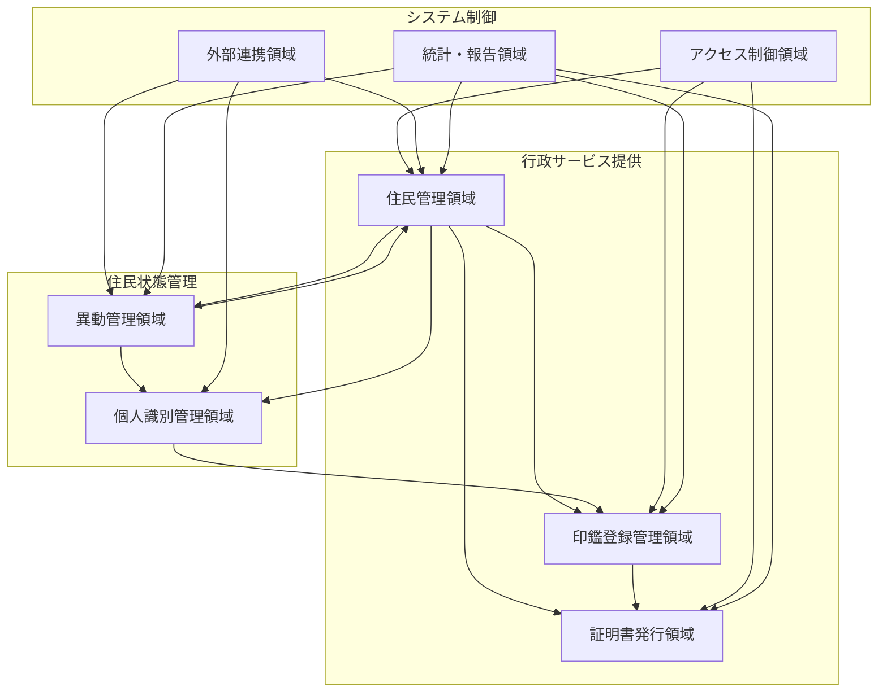

# ハイレベル概念モデル（領域モデル）

## 概要
石巻市住民基本台帳・印鑑登録システムの機能要件から抽出したビジネス領域（ドメイン）間の関係を表現するハイレベルな概念モデルです。

## 目的
- ビジネス領域間の関係を俯瞰的に理解する
- ステークホルダー間での認識合わせの基盤とする
- 詳細な概念データモデル作成の指針とする

## 主要ビジネス領域

### 1. 住民管理領域（Resident Management Domain）
**責務**: 住民の基本情報と生活状況の管理
- 住民の基本属性管理
- 世帯構成管理
- 住所・居住地管理
- 住民の生活状態追跡

### 2. 異動管理領域（Resident Movement Domain）
**責務**: 住民の状態変化の記録と処理
- 転入・転出処理
- 住所変更処理
- 世帯構成変更処理
- 戸籍関連変更処理
- 職権による変更処理

### 3. 個人識別管理領域（Personal Identification Domain）
**責務**: 住民の一意識別と番号管理
- 個人番号（マイナンバー）管理
- 住民票コード管理
- マイナンバーカード管理
- 番号の変更・訂正処理

### 4. 印鑑登録管理領域（Seal Registration Domain）
**責務**: 住民の印鑑登録と証明
- 印鑑の登録・抹消
- 印鑑登録証の発行・管理
- 印鑑証明書の発行
- 印鑑登録状況の管理

### 5. 証明書発行領域（Certificate Issuance Domain）
**責務**: 各種証明書の発行と管理
- 住民票の写し発行
- 印鑑登録証明書発行
- 転出証明書発行
- 証明書発行履歴管理

### 6. アクセス制御領域（Access Control Domain）
**責務**: 情報アクセスの制限と保護
- DV等支援措置
- 成年被後見人制限
- 処理停止管理
- 閲覧制限管理

### 7. 外部連携領域（External Integration Domain）
**責務**: 外部システムとの情報連携
- 住基ネット連携
- コンビニ交付システム連携
- 法務省入国管理情報連携
- 戸籍システム連携

### 8. 統計・報告領域（Statistics and Reporting Domain）
**責務**: 業務統計と各種報告の生成
- 人口統計作成
- 異動統計作成
- 法定報告書作成
- 業務実績報告作成

## 領域間関係図

## 重要なビジネスルール

### 1. 住民の一意性
- 住民は個人番号により一意に識別される
- 住民票コードも住民の一意識別子として機能する
- 一人の住民は複数の識別子を持つが、それらは1:1で対応する

### 2. 世帯と住民の関係
- 住民は必ず一つの世帯に属する
- 世帯には必ず世帯主が存在する
- 世帯主変更時も世帯の継続性は保持される

### 3. 異動の整合性
- すべての異動は法的根拠に基づく
- 異動は住民の状態を適切に反映する
- 転出入は他自治体との整合性を保つ

### 4. 印鑑登録の制約
- 印鑑登録は住民登録が前提条件
- 一人の住民につき一つの印鑑のみ登録可能
- 住民の異動（転出・死亡等）により印鑑登録は自動的に抹消される

### 5. アクセス制御の優先
- 支援措置対象者の情報は厳格に制限される
- 成年被後見人の手続きには特別な配慮が必要
- 制限対象者への証明書発行は原則停止される

## 導出根拠

### データソース
- 石巻市_住基台帳・印鑑登録_機能要件_Fill.csv の機能要件分析
- 業務フロー分析による領域責務の特定
- 法的要件（住民基本台帳法、印鑑登録条例等）の考慮

### モデリング手法
- ドメイン駆動設計（DDD）の境界づけられたコンテキストの概念を適用
- 機能要件からの名詞・動詞分析
- ビジネスプロセス分析による領域間関係の特定

### 検証観点
- 各領域の責務が明確で重複がないこと
- 領域間の依存関係が適切であること
- 法的要件と業務要件を網羅していること
- 将来の機能拡張に対する柔軟性があること

## 次ステップへの考慮事項

1. **詳細化の方向性**: 各領域内でのエンティティと関係の特定
2. **データ整合性**: 領域間でのデータ整合性ルールの明確化
3. **パフォーマンス考慮**: 高頻度アクセス領域の特定
4. **拡張性**: 新たな法改正や業務要件への対応策

このハイレベル概念モデルを基盤として、次段階では各領域内の詳細なエンティティとそれらの関係を定義した概念データモデルを作成します。