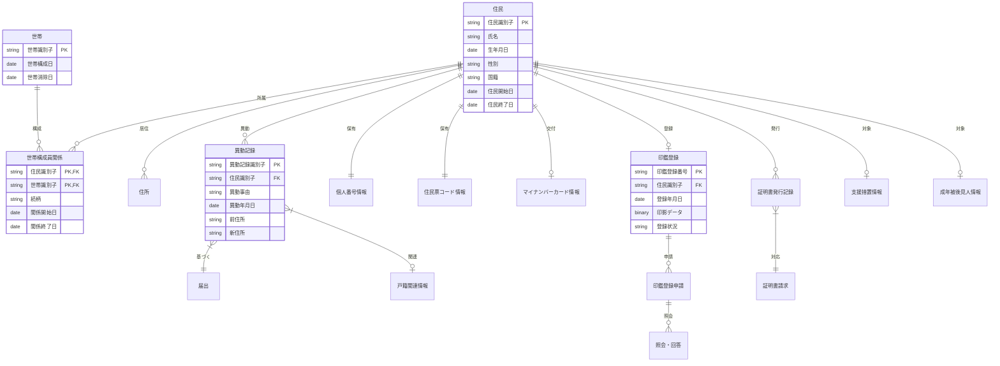

# 概念データモデル

## 概要
石巻市住民基本台帳・印鑑登録システムのビジネス要求を実装非依存で表現する概念データモデルです。ハイレベル概念モデルで特定した各領域内のエンティティとそれらの関係を詳細に定義します。

## 目的
- ビジネス要件を正確にデータ構造として表現する
- 実装技術に依存しない論理的なデータ関係を明確化する
- 論理データモデル作成の設計基盤とする

## 主要エンティティ

### 住民管理領域

#### 住民 (Resident)
**概念**: 市内に住所を有する個人
**主要属性**:
- 住民識別子
- 氏名（氏・名・フリガナ）
- 生年月日
- 性別
- 国籍・地域
- 住民となった年月日
- 住民でなくなった年月日
- 住民区分（日本人・外国人）

#### 世帯 (Household)
**概念**: 住居と生計を共にする住民の集合体
**主要属性**:
- 世帯識別子
- 世帯構成年月日
- 世帯消除年月日
- 世帯区分（一般世帯・単身世帯等）

#### 世帯構成員関係 (Household Member Relation)
**概念**: 住民と世帯の関係および続柄
**主要属性**:
- 続柄（世帯主・配偶者・子・その他）
- 関係開始日
- 関係終了日

#### 住所 (Address)
**概念**: 住民の居住地の地理的位置
**主要属性**:
- 住所識別子
- 都道府県コード
- 市区町村コード
- 大字・字
- 地番・地号
- 住居番号
- 方書（建物名・部屋番号等）
- 住居表示フラグ

### 異動管理領域

#### 異動記録 (Residence Change Record)
**概念**: 住民の状態変化を記録する履歴情報
**主要属性**:
- 異動記録識別子
- 異動事由（転入・転出・出生・死亡等）
- 異動年月日
- 異動届出年月日
- 異動処理年月日
- 前住所（転入の場合）
- 新住所（転出の場合）
- 異動理由詳細

#### 届出 (Application)
**概念**: 住民からの各種申請・届出
**主要属性**:
- 届出識別子
- 届出種別（転入届・転出届・転居届等）
- 届出年月日
- 受理年月日
- 届出者情報
- 処理状況

#### 戸籍関連情報 (Family Registry Related Info)
**概念**: 戸籍システムから連携される情報
**主要属性**:
- 本籍地
- 筆頭者
- 戸籍関連事由（出生・婚姻・離婚等）
- 戸籍届出年月日

### 個人識別管理領域

#### 個人番号情報 (Personal Number Info)
**概念**: 個人番号（マイナンバー）の管理情報
**主要属性**:
- 個人番号
- 個人番号指定年月日
- 個人番号変更履歴
- 団体内統合利用番号

#### 住民票コード情報 (Resident Code Info)
**概念**: 住民票コードの管理情報
**主要属性**:
- 住民票コード
- 住民票コード指定年月日
- 住民票コード変更履歴

#### マイナンバーカード情報 (My Number Card Info)
**概念**: マイナンバーカードの発行・管理情報
**主要属性**:
- カード交付番号
- カード発行年月日
- カード有効期限
- カード交付状況
- 利用者証明用電子証明書情報

### 印鑑登録管理領域

#### 印鑑登録 (Seal Registration)
**概念**: 住民の印鑑登録情報
**主要属性**:
- 印鑑登録番号
- 登録年月日
- 印影データ
- 印鑑登録証番号
- 登録状況（有効・抹消）
- 抹消年月日
- 抹消事由

#### 印鑑登録申請 (Seal Registration Application)
**概念**: 印鑑登録に関する申請情報
**主要属性**:
- 申請識別子
- 申請種別（新規・変更・廃止）
- 申請年月日
- 申請者区分（本人・代理人）
- 身元確認方法
- 申請状況

#### 照会・回答 (Inquiry and Response)
**概念**: 本人確認のための照会・回答情報
**主要属性**:
- 照会識別子
- 照会年月日
- 回答年月日
- 照会内容
- 回答内容
- 照会状況

### 証明書発行領域

#### 証明書発行記録 (Certificate Issuance Record)
**概念**: 各種証明書の発行履歴
**主要属性**:
- 発行記録識別子
- 証明書種別（住民票・印鑑証明等）
- 発行年月日
- 発行部数
- 請求者情報
- 使用目的
- 発行窓口

#### 証明書請求 (Certificate Request)
**概念**: 証明書発行の請求情報
**主要属性**:
- 請求識別子
- 請求年月日
- 請求者区分（本人・代理人・第三者）
- 請求理由
- 本人確認資料

### アクセス制御領域

#### 支援措置情報 (Support Measure Info)
**概念**: DV等被害者への支援措置情報
**主要属性**:
- 支援措置識別子
- 措置開始年月日
- 措置終了年月日
- 措置理由
- 制限範囲
- 申立者情報

#### 成年被後見人情報 (Adult Guardianship Info)
**概念**: 成年被後見人の制限情報
**主要属性**:
- 後見情報識別子
- 後見開始年月日
- 後見終了年月日
- 後見人情報
- 制限内容

## エンティティ関係図

## 重要なビジネスルール

### 1. 住民と世帯の関係
- 住民は常に一つの世帯に属する（必須関係）
- 世帯には必ず世帯主が存在する
- 世帯主変更時も世帯の継続性は維持される

### 2. 個人識別子の一意性
- 個人番号は全国で一意
- 住民票コードは自治体内で一意
- 一人の住民に対して個人番号と住民票コードは1:1対応

### 3. 異動の整合性
- すべての異動は法的根拠（届出または職権）に基づく
- 転出入異動は前住所・新住所の整合性を保つ
- 異動により世帯構成が変化する場合は自動的に世帯関係も更新

### 4. 印鑑登録の制約
- 印鑑登録は住民登録が前提条件（住民でない者は登録不可）
- 一人の住民につき同時に有効な印鑑登録は一つまで
- 住民の転出・死亡等により印鑑登録は自動的に抹消

### 5. 証明書発行の制限
- 支援措置対象者は証明書発行が制限される
- 成年被後見人は本人による申請が制限される
- 第三者請求には正当な理由と本人確認が必要

### 6. データの時系列管理
- 住民情報は履歴管理される（現在情報と過去履歴）
- 異動記録により住民の状態変化が追跡可能
- 証明書発行時点での情報を正確に反映

## 概念モデルの妥当性検証

### 1. 完全性の確認
- [x] 機能要件で言及される全てのデータ要素がエンティティまたは属性として表現されている
- [x] 主要なビジネスプロセスがエンティティ関係で表現可能
- [x] 法的要件（住民基本台帳法、印鑑登録条例）がモデルに反映されている

### 2. 一貫性の確認
- [x] エンティティ名と属性名の命名規則が統一されている
- [x] 関係の方向性と多重度が業務ルールと整合している
- [x] 同一概念が複数のエンティティで重複定義されていない

### 3. 正確性の確認
- [x] ビジネス用語の定義がドメイン知識と合致している
- [x] エンティティ間の関係が実際の業務フローと対応している
- [x] 属性の定義が業務で使用される情報と合致している

## 次ステップへの課題

### 1. 正規化の検討
- エンティティ内の属性間の関数従属性を分析
- 冗長性の排除と更新異常の防止
- パフォーマンスと正規化のバランス調整

### 2. 制約の詳細化
- 各属性のデータ型と制約の定義
- 参照整合性制約の詳細仕様
- ビジネスルールのチェック制約への変換

### 3. 曖昧性の解消
- 同一属性名の異なる意味の解決
- 省略可能属性の明確化
- 例外ケースの処理ルール策定

## 導出根拠

### データソース
- 石巻市_住基台帳・印鑑登録_機能要件_Fill.csv の全152機能の詳細分析
- 住民基本台帳法および関連政令・省令の参照
- 石巻市印鑑登録条例・規則の参照

### モデリング手法
- エンティティ関係モデリング（ERM）手法の適用
- 名詞・動詞分析による概念抽出
- ビジネスプロセス分析による関係特定
- ドメインエキスパートレビュー（文書ベース）

この概念データモデルを基盤として、次段階では実装を考慮した論理データモデルを作成し、正規化やパフォーマンス最適化を行います。